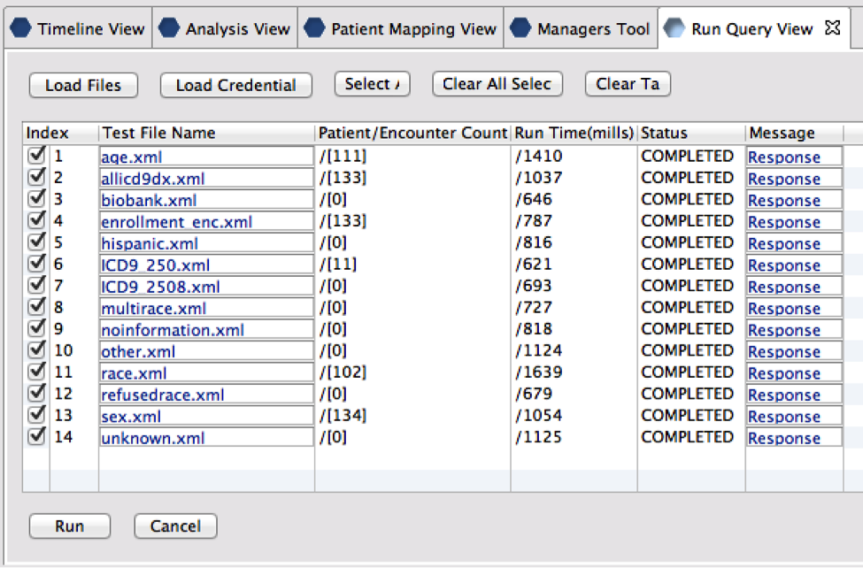

# Testing Your i2b2 Mappings 

## (Using the CRC Tester)

## Introduction

This guide will help you install the i2b2 workbench and CRC Tester and subsequently run a small set of queries on your ontology, to perform simple tests of your demographics and diagnosis mappings. These are very simple queries that return counts for some of your demographic and diagnosis trees, to ensure they are mapped to something. This does not ensure the mapping is correct, only that you have done a mapping and successfully updated your concept_dimension. These tests can be used by you to detect high-level problems, and you will also send your results to us as a verification that your mapping of demographics and diagnoses is complete.

## Installation and Usage

1. Download the i2b2 workbench (desktop client): [https://www.i2b2.org/software/index.html](https://www.i2b2.org/software/index.html) (click on ‘i2b2 workbench’ in the lower left)

2. Download the CRC tester plugin: [https://community.i2b2.org/wiki/display/CRCTester/CRC+Tester+Plug-in](https://community.i2b2.org/wiki/display/CRCTester/CRC+Tester+Plug-in)

3. Unzip the workbench to a directory and then follow the CRC Tester Installation Instructions to install the CRC Tester JAR file: [https://community.i2b2.org/wiki/display/CRCTester/Add+JAR+File](https://community.i2b2.org/wiki/display/CRCTester/Add+JAR+File)

4. Edit the i2b2workbench.properties file to point to your i2b2 instance (further instructions can be found in the workbench documentation (downloadable from the first link above).

5. Run the workbench, login, and add the Run Query view to your i2b2 desktop, as described here: [https://community.i2b2.org/wiki/display/CRCTester/Add+Run+Query+View](https://community.i2b2.org/wiki/display/CRCTester/Add+Run+Query+View)

6. Copy the scilhs_test_xml_v1 directory to the i2b2 workbench directory.

7. In the Run Query View of the workbench, click "Load Files" and choose the scilhs_test_xml_v1 directory. 

8. Click Run. The queries will take a few minutes to complete. 

9. You can use the results to detect common errors in ontology mapping. (See next section.)

10. When you are satisfied with the results, please take a screenshot of the results and email it to us. Be sure the run query view is large enough to show all the results.

## Common Errors

The queries should not return an error, even if you have not yet done mappings. Please try to correct errors before sending results to us.  

* All ICD-9 queries fail: You have not updated your concept_dimension table.

* Age query fails: You are using the wrong database-version of the ontology (e.g., Sqlserver ontology on an Oracle database).

* Enrollment query fails: You have not updated to v1.4 of the ontology.

* Biobank query fails: This is a known issue that we will provide detailed instructions for correcting. The ontology term for BIOBANK_FLAG:Y needs to have a C_COLUMNDATATYPE of T (it is currently ‘@’).

Some queries will return counts of 0 even after mapping. However, if terms you have mapped return zero, your mapping is probably incorrect. For example:

* allicd9dx returns 0: None of your ICD-9 terms are mapped.

* sex, race, or hispanic return 0: The respective section of your demographics is not mapped.

A sample screenshot using the demodata on the i2b2.org site:

